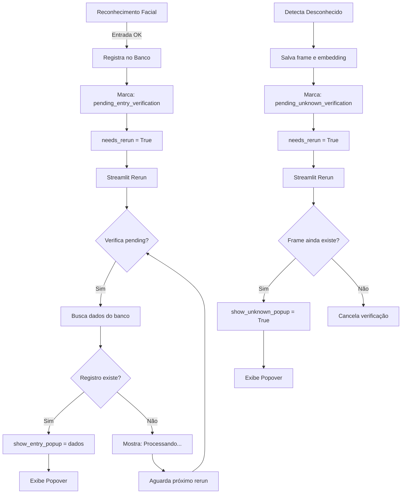

# 🔄 Novo Fluxo de Popovers com Verificação

## 📋 Visão Geral

Sistema reformulado onde os **popovers verificam os dados no banco APÓS o rerun**, garantindo que sempre exibirão informações atualizadas e corretas.

---

## 🎯 Problema Anterior

### ❌ Fluxo Antigo (Com Falhas)
```
1. Thread assíncrona registra entrada
2. Thread define dados do popover
3. Thread marca needs_rerun
4. Rerun acontece
5. Popover tenta exibir dados
   ❌ Dados podem estar desatualizados
   ❌ Registro pode não estar confirmado
   ❌ Popover pode falhar
```

### ✅ Fluxo Novo (Robusto)
```
1. Thread assíncrona registra entrada
2. Thread marca "pendente de verificação"
3. Thread marca needs_rerun
4. Rerun acontece
5. Sistema busca dados atualizados do banco
6. Sistema verifica se registro foi confirmado
7. ✅ Popover exibe dados verificados e corretos
```

---

## 🔧 Como Funciona

### 1️⃣ **Entrada Reconhecida**

#### Passo 1: Registro (Thread Assíncrona)
```python
# Na thread de reconhecimento facial:
if success:
    verification_data = {
        'person_id': person_id,
        'person_name': person_name,
        'timestamp': time.time()
    }
    
    # Marca como PENDENTE (não exibe ainda)
    st.session_state.pending_entry_verification = verification_data
    st.session_state.needs_rerun = True
```

#### Passo 2: Verificação (Após Rerun)
```python
# No próximo render da página:
if st.session_state.get('pending_entry_verification'):
    # BUSCA dados atualizados do banco
    access_records = db_ops.load_access_records()
    
    # Filtra registro mais recente da pessoa
    recent_entry = find_recent_entry(person_id, access_records)
    
    if recent_entry:
        # ✅ CONFIRMADO - Exibe popover
        st.session_state.show_entry_popup = {
            'name': recent_entry['name'],
            'time': recent_entry['horario_entrada'],
            'company': recent_entry['empresa']
        }
        del st.session_state['pending_entry_verification']
    else:
        # ⏳ Ainda processando - aguarda
        st.info("⏳ Processando entrada...")
```

#### Passo 3: Exibição
```python
# Popover é exibido apenas com dados verificados
if st.session_state.get('show_entry_popup'):
    popup = st.session_state.show_entry_popup
    
    with st.popover("🟢 ✅ ENTRADA REGISTRADA"):
        st.markdown(f"**Nome:** {popup['name']}")
        st.markdown(f"**Horário:** {popup['time']}")
        st.markdown(f"**Empresa:** {popup['company']}")
```

---

### 2️⃣ **Pessoa Não Identificada**

#### Passo 1: Detecção (Thread de Vídeo)
```python
# Quando detecta rosto desconhecido:
if detected_faces:
    st.session_state.last_unknown_frame = img.copy()
    st.session_state.last_unknown_embedding = detected_faces[0]['embedding']
    
    # Marca como PENDENTE
    st.session_state.pending_unknown_verification = True
    st.session_state.needs_rerun = True
```

#### Passo 2: Verificação (Após Rerun)
```python
# No próximo render:
if st.session_state.get('pending_unknown_verification'):
    # Verifica se frame ainda está disponível
    if st.session_state.get('last_unknown_frame') is not None:
        # ✅ CONFIRMADO - Exibe popover
        st.session_state.show_unknown_popup = True
        del st.session_state['pending_unknown_verification']
    else:
        # ❌ Frame perdido - cancela
        del st.session_state['pending_unknown_verification']
```

---

## 📊 Diagrama de Fluxo



---

## 🎯 Benefícios

### ✅ Dados Sempre Atualizados
- Popover busca dados direto do banco após registro
- Garante que horário, nome e empresa estão corretos
- Evita mostrar dados desatualizados ou cached

### ✅ Resistente a Falhas
- Se registro falhar, popover não aparece
- Se dados não estiverem prontos, mostra "Processando..."
- Sistema aguarda até confirmar registro

### ✅ Sincronização Perfeita
- Auto-refresh verifica a cada 2 segundos
- Prioriza verificações pendentes
- Mantém stream ativo durante verificação

### ✅ Logs Consistentes
- Logs são registrados antes da verificação
- Timestamp correto em todos os eventos
- Auditoria completa do processo

---

## 🔄 Auto-Refresh Inteligente

### Prioridades
```python
# A cada 2 segundos, verifica na ordem:

1. pending_entry_verification
   → Busca dados do banco
   → Confirma registro
   → Exibe popover

2. pending_unknown_verification
   → Verifica frame disponível
   → Exibe popover

3. show_entry_popup
   → Popover já verificado
   → Mantém exibição

4. show_unknown_popup
   → Popover já verificado
   → Mantém exibição
```

### Condições para Rerun
- ✅ WebRTC stream está ativo
- ✅ Há verificações pendentes
- ✅ Passou 2 segundos desde última verificação
- ❌ Não faz rerun durante inicialização

---

## 📝 Variáveis de Session State

### Estados de Verificação
```python
# Entrada reconhecida
pending_entry_verification = {
    'person_id': 123,
    'person_name': 'João Silva',
    'timestamp': 1234567890.123
}

# Pessoa não identificada
pending_unknown_verification = True

# Frame capturado
last_unknown_frame = numpy.array([...])
last_unknown_embedding = [0.123, 0.456, ...]
```

### Estados de Exibição
```python
# Popover de entrada
show_entry_popup = {
    'name': 'João Silva',
    'time': '14:30',
    'company': 'Empresa ABC',
    'timestamp': 1234567890.123
}

# Popover de desconhecido
show_unknown_popup = True
```

### Flags de Controle
```python
# Controle de rerun
needs_rerun = True
auto_start_attempted = False

# Controle de toast
unknown_popup_shown = True
toast_shown_1234567890 = True

# Auto-refresh
last_refresh_check = 1234567890.123
```

---

## 🧪 Testes

### Teste 1: Entrada Reconhecida
1. ✅ Passe pela câmera com rosto cadastrado
2. ✅ Aguarde 1-2 segundos
3. ✅ Popover verde deve aparecer com dados corretos
4. ✅ Nome, horário e empresa devem estar atualizados
5. ✅ Clique em "OK" - popover fecha, stream continua

### Teste 2: Pessoa Não Identificada
1. ✅ Passe pela câmera com rosto não cadastrado
2. ✅ Aguarde 1-2 segundos
3. ✅ Popover laranja deve aparecer
4. ✅ Frame deve estar capturado
5. ✅ Botões "Cadastrar" e "Ignorar" funcionam

### Teste 3: Verificação de Logs
1. ✅ Vá para Painel Administrativo → Logs
2. ✅ Verifique log de entrada (FACE_ACCESS_STREAM_GRANTED)
3. ✅ Timestamp deve corresponder à entrada real
4. ✅ Person ID deve estar correto

### Teste 4: Falha Simulada
1. ❌ Simule falha no banco de dados
2. ✅ Popover não deve aparecer
3. ✅ Deve mostrar "Processando..." indefinidamente
4. ✅ Ao restaurar banco, popover aparece normalmente

---

## 🚀 Performance

### Tempos Esperados
- **Registro no banco:** ~200-500ms
- **Verificação após rerun:** ~100-200ms
- **Exibição do popover:** Instantânea
- **Total (registro → popover):** ~2-3 segundos

### Otimizações
- ✅ Auto-refresh a cada 2s (não sobrecarrega)
- ✅ Verificação apenas quando necessário
- ✅ Cache limpo seletivamente
- ✅ Stream nunca é interrompido

---

## 🔧 Manutenção

### Adicionar Novo Campo ao Popover
```python
# 1. Ajuste a verificação para buscar o campo
recent_entry = find_recent_entry(person_id, access_records)
popup_data = {
    'name': recent_entry.get('name'),
    'time': recent_entry.get('horario_entrada'),
    'company': recent_entry.get('empresa'),
    'novo_campo': recent_entry.get('novo_campo')  # ← ADICIONE AQUI
}

# 2. Ajuste o popover para exibir
st.markdown(f"**Novo Campo:** {popup['novo_campo']}")
```

### Ajustar Timeout de Verificação
```python
# Em auto-refresh, altere o intervalo:
if time_since_check > 5:  # ← Era 2, agora 5 segundos
    st.session_state.last_refresh_check = current_time
```

### Debug de Problemas
```python
# Adicione logs temporários:
if st.session_state.get('pending_entry_verification'):
    st.write("DEBUG: Verificando entrada...")
    st.write(f"Person ID: {verification_data['person_id']}")
    st.write(f"Registros encontrados: {len(access_records)}")
```

---

## 📚 Referências

- **Arquivo:** `app/face_access_stream.py`
- **Linhas:** 110-195 (Verificação e exibição de popovers)
- **Linhas:** 860-900 (Registro assíncrono)
- **Linhas:** 575-590 (Auto-refresh)

---

**Última atualização:** 21/11/2025  
**Versão:** 3.0 - Sistema de Verificação Pós-Rerun

